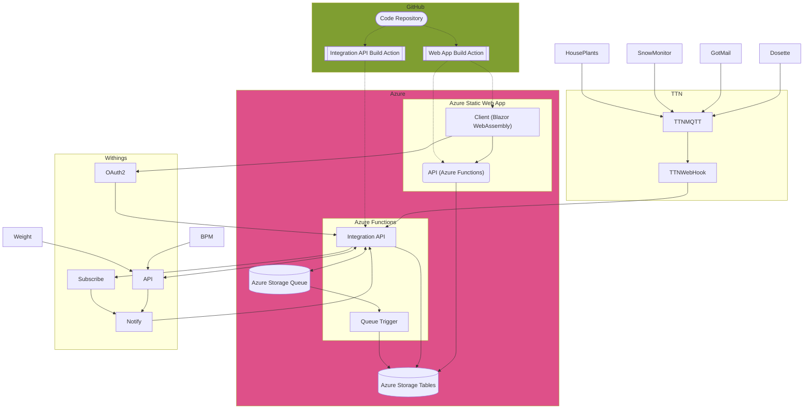

# Potty Trainer

This is a web app used to reenforce positive behavior. It consists of the following main parts:
- A Blazor WebAssembly app
- .Net API
- Azure Functions integration platform
- Azure Storage Tables
- Azure Storage Queues

Various sensors and activity platforms are integrated:
- Withings, including (but not limited to)
  - Body scale
  - BPM Core
- The Things Network, Custom LoRaWan devices
  - [Mailbox](https://community.element14.com/challenges-projects/project14/rf/b/blog/posts/got-mail-lorawan-mail-box-sensor)
  - [Soil moisture](https://community.element14.com/challenges-projects/project14/theholidayspecial19/b/blog/posts/deck-the-halls-with-holiday-flowers---and-keep-them-alive)
  - [Dosette (Pill box)](https://www.hackster.io/eivholt/microchip-digital-dosette-e6a8c8)
  - [Snow depth](https://www.hackster.io/eivholt/low-power-snow-depth-sensor-using-lora-e5-b8e7b8)

Follow the hands-on tutorial to [publish a Blazor WebAssembly app and .NET API with Azure Static Web Apps](https://docs.microsoft.com/learn/modules/publish-app-service-static-web-app-api-dotnet/?WT.mc_id=mslearn_staticwebapp-github-aapowell).

